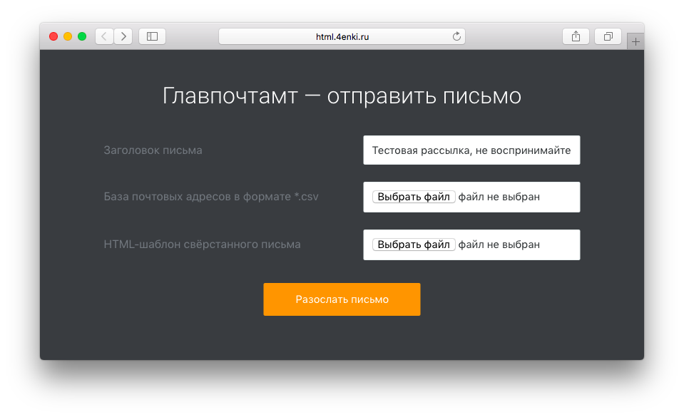

# Главпочтамт отправляет свёрстанный макет письма

Главпочтамт — удобное тестирование свёрстанных писем. Умеет отправлять вёрстку письма на адреса электронных почт в *.csv-файле.

## Как работает

### От кого и куда

Настройка базовых параметров — в файле `mail.php`: данные отправителя `$frm_name = "Sergey Glazov";` и `$frm_email = "yaglazov+test@gmail.com";`.

Базовый набор адресов для рассылки расположен в файле `projects/default_base.csv`.

### Шаблон: разметка и стили

Для вёрстки красивых, адаптивных и удобных писем используется [Kilogram](https://github.com/dudeonthehorse/kilogram). Важно использовать поддерживаемые теги, [свойства](https://freshmail.com/developers/best-practices-for-email-coding/) и [стили](https://www.campaignmonitor.com/css/).

### Картинки и графика

Контентые картинки и фоновые изображения следует размещать на отдельном сервере и в шаблоне указывать полный путь.

## После рассылки

После завершения рассылки появится алерт с текстом `Ready`.

----

## To Do

- [ ] Выяснить лимиты на отправку писем на сервере
- [ ] Отказаться от alert'a при успешной рассылке. Сделать красивые уведомление о завершении и/или проблемах при отправке;
- [ ] Облагородить поля для прикрепления файлов в стилевом плане;
- [ ] CSS → SCSS;
- [ ] Комменты в коде, минификация.
